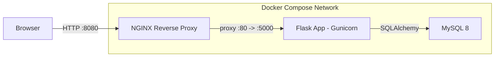

# Flask Notes Webapp – Nginx + Flask + MySQL (Docker Compose)

Production-like demo: reverse proxy (nginx), Flask API/UI with AJAX, MySQL persistence, migrations (Flask-Migrate), pagination, search, edit/delete, metrics, healthchecks, non-root container, multi-stage build.

## Architecture



## Quick Start (Local)

```bash
cp .env.example .env
docker compose up -d --build
# open http://localhost:8080
```

**Health & Metrics**
- `GET /health` → OK when DB reachable & table present
- `GET /metrics` → Prometheus text (uptime, requests, notes count)

**API**
- `POST /notes` JSON `{"content":"Buy milk"}` → 201
- `GET /notes?search=milk&page=1&limit=10` → list
- `PUT /notes/<id>` JSON `{"content":"..."} `
- `DELETE /notes/<id>`

## Amazon EC2 (Amazon Linux 2023) – Free Tier Deployment

> Instance type: `t2.micro` or `t3.micro`  
> AMI: **Amazon Linux 2023**  
> Security Group: allow inbound `22/tcp` and `8080/tcp` (or your chosen HOST_PORT)

1) **Launch EC2** and connect:
```bash
ssh -i /path/to/key.pem ec2-user@EC2_PUBLIC_IP
```

2) **Install Docker & Compose plugin**
```bash
sudo dnf update -y
sudo dnf install -y docker docker-compose-plugin git
sudo systemctl enable --now docker
sudo usermod -aG docker ec2-user
# re-login to pick up docker group or run:
newgrp docker
docker --version
docker compose version
```

3) **Get project on the server**
- Option A: `git clone` your repo  
- Option B: upload zip via scp, then unzip
```bash
# Example using git (replace with your repo)
git clone https://github.com/your/repo.git flask-notes-compose
cd flask-notes-compose
```

4) **Configure environment**
```bash
cp .env.example .env
# Edit .env with your secrets (strong passwords!)
nano .env
```

5) **Build & run**
```bash
docker compose up -d --build
docker compose ps
```

6) **Test from your machine**
- Visit: `http://EC2_PUBLIC_IP:8080`
- Health: `curl -fsS http://EC2_PUBLIC_IP:8080/health`
- Metrics: `curl -fsS http://EC2_PUBLIC_IP:8080/metrics`

7) **Logs & troubleshooting**
```bash
docker compose logs -f web
docker compose logs -f db
docker compose logs -f nginx
docker exec -it notes_db mysql -u"$MYSQL_USER" -p"$MYSQL_PASSWORD" -e "SHOW DATABASES;"
docker inspect --format='{{json .State.Health}}' notes_web | jq .
```
Common fixes:
- Security group not open on port 8080 → update inbound rules.
- Recreate clean DB:
```bash
docker compose down
docker volume rm flask-notes-compose_mysql_data
docker compose down -v (better option)
docker compose up -d --build
```

8) **Stop & remove**
```bash
docker compose down
```

## Linting
```bash
docker run --rm -v $PWD:/app -w /app python:3.11-slim bash -lc "pip install -r requirements.txt flake8 && flake8"
# or, if you have Python locally:
pip install -r requirements.txt flake8
flake8
```

## Project Structure
```
.
├── app/
│   ├── __init__.py
│   ├── models.py
│   ├── routes.py
│   ├── metrics.py
│   ├── extensions.py
│   ├── templates/            # HTML (Tailwind via CDN)
│   └── static/
│       └── app.js            # AJAX logic
│
├── migrations/               # Alembic + Flask-Migrate files
│
├── nginx/
│   └── nginx.conf            # Reverse proxy to web app
│
├── Dockerfile                # Multi-stage build (non-root)
├── docker-compose.yml        # Services: web, db, nginx
├── entrypoint.sh             # Wait for DB → run migrations → Gunicorn
├── requirements.txt
├── .env.example
└── .flake8
```

---

### cURL Examples
```bash
# Create note
curl -X POST -H "Content-Type: application/json" \
  -d '{"content":"Buy milk"}' \
  http://EC2_PUBLIC_IP:8080/notes

# List notes (with pagination & search)
curl "http://EC2_PUBLIC_IP:8080/notes?page=1&limit=5&search=milk"

# Update note
curl -X PUT -H "Content-Type: application/json" \
  -d '{"content":"Buy milk and eggs"}' \
  http://EC2_PUBLIC_IP:8080/notes/1

# Delete note
curl -X DELETE http://EC2_PUBLIC_IP:8080/notes/1

# Health
curl -f http://EC2_PUBLIC_IP:8080/health

# Metrics
curl http://EC2_PUBLIC_IP:8080/metrics
```

## Notes
- Tailwind uses CDN for simplicity; for production, consider a Node-based build to purge unused styles.
- `/metrics` is basic and in-process; for advanced needs, use a Prometheus client.
- `/health` queries the DB and checks the `notes` table.
